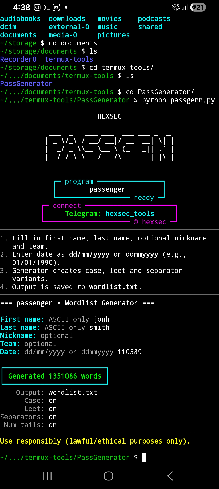

# Passgen

```
  _  _ _____  _____ ___ ___ 
 | || | __\ \/ / __| __/ __|
 | __ | _| >  <\__ \ _| (__ 
 |_||_|___/_/\_\___/___\___|
```

**passenger** is a Python tool built for **educational purposes** by **Hexec**.  
It runs perfectly on **Termux (Android)** and any Linux terminal.  

The main purpose is to **generate custom wordlists** based on user-provided info (name, surname, nickname, team, date of birth, etc.).  
The tool automatically applies variations like **case transformations**, **leet speak**, **numeric tails**, and **token combinations**.

---

## ⚠️ Disclaimer
This tool was created **strictly for educational and security research purposes**.  
It should only be used on your own accounts, systems, or in authorized security testing.  
**Hexec** and contributors are **not responsible for misuse** of this tool.

---

## 📲 Installation (Termux)

```bash
pkg update -y && pkg install -y python
pip install --upgrade pip rich
git clone https://github.com/hexsecteam/Passgen.git
cd Passgen
python Passgen.py
```

If colors/borders don’t show properly in Termux:
```bash
export TERM=xterm-256color
export COLORTERM=truecolor
```

---

## 🚀 Usage

When you run:

```bash
python passenger.py
```

You will see the **banner** and a small help panel.  
Then you will be asked to fill in:

- First name
- Last name
- Nickname (optional)
- Team (optional)
- Date (formats: `dd/mm/yyyy` or `ddmmyyyy`)

Example run:

```
=== passenger • Wordlist Generator ===

First name: john
Last name: doe
Nickname: jd
Team: united
Date: 01/01/1990
```

Output:

```
✅ Generated 12456 words in 'wordlist.txt'.
```

---

## 🖼️ UI Preview

Add here a screenshot of the tool running in Termux:



*(replace `images/ui_preview.png` with the actual path of your screenshot in the repo)*

---

## ⚙️ Variables / Settings

Inside `passenger.py` (top of file) there are several variables you can tweak:

```python
MAX_COMBO_TOKENS = 3          # how many tokens to combine (1-3)
ADD_LEET = True               # enable leetspeak variations (a→4, e→3, s→5, etc.)
ADD_CASE_VARIANTS = True      # generate lower/UPPER/Capitalized/CamelCase
ADD_SEPARATORS = True         # insert -, _, . between tokens
ADD_NUM_TAILS = True          # append numeric endings (00–99, recent years)
MIN_LEN = 4                   # minimum word length allowed
MAX_LEN = 24                  # maximum word length allowed
OUTPUT_FILE = "wordlist.txt"  # name of output file
```

- **MAX_COMBO_TOKENS** → controls how many input tokens (name, surname, date, etc.) can be combined in one word. Example: `3` allows `johnDoe1990`.  
- **ADD_LEET** → if `True`, adds leetspeak versions (e.g. `john → j0hn`).  
- **ADD_CASE_VARIANTS** → if `True`, adds different casing styles (`john`, `JOHN`, `John`, `JohnDoe`).  
- **ADD_SEPARATORS** → if `True`, inserts `-`, `_`, `.` between tokens (`john.doe`, `john-doe`).  
- **ADD_NUM_TAILS** → if `True`, appends numbers (`john1`, `john99`, `john2024`).  
- **MIN_LEN / MAX_LEN** → filters out too short or too long words.  
- **OUTPUT_FILE** → name of the generated wordlist file.  

---

## 📸 Example Output

Input:
```
First name: alice
Last name: wonder
Nickname: ali
Team: hexsec
Date: 31/12/1999
```

Output file `wordlist.txt` will contain entries like:

```
alice
Alice
ALICE
ali31
wonder1999
hexsec-alice
a1ice
AliceWonder99
1999WonderAlice
...
```

---

## 👤 Author

Made with ❤️ by **Hexec**  
For educational & research purposes.

---

## 🔗 HexSec Social Media

🛠️ Join our tools, tutorials & exploit community  

- 📦 **Telegram Group**: [https://t.me/hexsectools](https://t.me/hexsectools)  
- 📬 **Contact (Direct Message)**: [https://t.me/Hexsecteam](https://t.me/Hexsecteam)  

### Follow us on social media
- 📸 **Instagram**: [https://instagram.com/hex.sec](https://instagram.com/hex.sec)  
- ▶️ **YouTube**: [https://youtube.com/@hex_sec](https://youtube.com/@hex_sec)  
- 💻 **GitHub**: [https://github.com/hexsecteam](https://github.com/hexsecteam)  
- 🎞️ **Vimeo**: [https://vimeo.com/hexsec](https://vimeo.com/hexsec)  
- 📹 **Dailymotion**: [https://www.dailymotion.com/hexsectools/videos](https://www.dailymotion.com/hexsectools/videos)  

---

## 🛠️ Tech

- Python 3  
- [Rich](https://github.com/Textualize/rich) (for colors/UI)  

---

## 🧩 Roadmap

- [ ] Add CLI arguments (`--name john --surname doe`)  
- [ ] Add JSON/CSV export  
- [ ] Add more leetspeak rules  
- [ ] Support wordlist merging  

---

## 📜 License

MIT License – free to use, modify, share.  
Please keep credits to **Hexec**.
